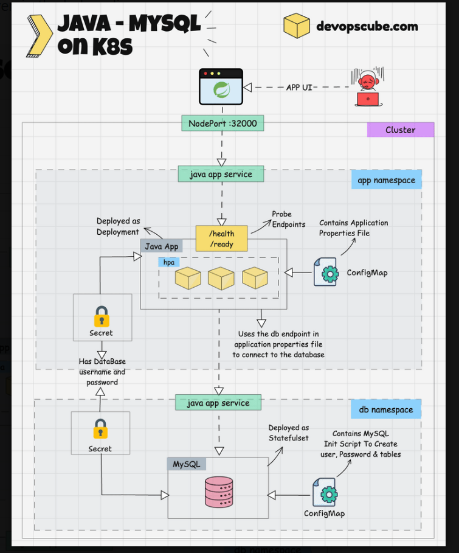

## Prerequisites
- **Kubernetes Cluster**
- **kubectl**
- **Maven** (3.9.6) and **Java-17** installed on your system
- **Docker** installed
- Access to a **Docker Hub** repository to push the Docker image
- **MySQL client** (Optional) – If you plan to log in to your MySQL database through CLI

You will practically use the following key Kubernetes objects. It will help you understand how these objects can be used in real-world project implementations:

Deployment
HPA
ConfigMap
Secrets
StatefulSet
Service
Namespace

ALSO
Create an application properties file from ConfigMap to be consumed by the app
Startup, readiness, and liveness probes
Consuming secret and configmap data using Environment Variables
MySQL initialization script from ConfigMap to create tables

## Build and Create Java Application Docker Image
Clone the Git repository below
https://github.com/spring-projects/spring-petclinic.git

Step 1: Build the Java Application

mvn clean install

## Step 2: Build a Docker Image of the Application

To build the docker image of the application, create a Dockerfile nside the spring-petclinic directory
docker build -t kube-petclinic-app:1.0.0 .

Step 3: Push the image to DockerHub : tag the image

docker tag kube-petclinic-app:3.0.0 docker_username/kube-petclinic-app:3.0.0
## Push to docker hub
docker push docker_username/kube-petclinic-app:3.0.0

## Deploy Java & MySQL On Kubernetes

Clone the Git repository given below which contains all the YAML manifest 
git clone https://github.com/techiescamp/kubernetes-projects.git

## Step 1: Create Namespaces

kubectl create ns pet-clinic-app
kubectl create ns pet-clinic-db

Step 2: Create Secrets
Change the namespace and run the secret.yml file two times to create a secret in both pet-clinic-app and pet-clinic-db namespaces.
The secret won’t be created unless you specify your username and password in base64-encoded values.
echo -n '<data>' | base64
echo -n 'username/password' | base64

kubectl apply -f secret.yml

kubectl get secret -n pet-clinic-app
kubectl get secret -n pet-clinic-db

Step 3: Create ConfigMap for MySQL

CD into the java-app-deployment/mysql directory and run the configmap.yml.
This creates a configmap mysql-configmap on the pet-clinic-db namespace, that contains the SQL command to create a user, password, and tables on the database, and to insert data on the table.
It gets the username and password from env variables, which are retrieved from the secret.

kubectl apply -f configmap.yml
Verify
kubectl get cm -n pet-clinic-db

Step 4: Deploy MySQL Database

CD into the java-app-deployment/mysql directory and run the mysql.yml.
This file deploys a MySQL statefulset database on the pet-clinic-db namespace and also a nodeport service mysql-service on the pet-clinic-db namespace so we can log in to MySQL from outside the cluster

kubectl apply -f mysql.yml
kubectl get sts -n pet-clinic-db

Step 5: Create ConfigMap for Java Application

CD into the java-app-deployment/java-app folder and run the configmap.yml

kubectl apply -f configmap.yml
Verify
kubectl get cm -n pet-clinic-app

Step 6: Deploy Java Application

kubectl apply -f java.yml

kubectl get deploy -n pet-clinic-app

Step 7: Deploy HorizontalPodAutoscaler (HPA)

For HPA to work, you need to have a metrics server running in the cluster.

If you don’t have a metrics server, you can install the Metrics server using the following command.

kubectl apply -f https://raw.githubusercontent.com/techiescamp/kubeadm-scripts/main/manifests/metrics-server.yaml
Now, run the top command to check if the metrics server is installed properly

kubectl top po -n pet-clinic-app

Now, deploy the HorizontalPodAutoscaler in your cluster.

You can find the below HPA file inside the java-app-deployment/java-app directory.

kubectl apply -f hpa.yml

kubectl get hpa -n pet-clinic-app

Step 8: Access the Java Application

Once the pod is up and running, check if the application is deployed properly by trying to access it on the browser, search on the browser as {node-IP:nodeport} you will get the following

Step 9: Clean Up

1. Delete Java App Deployment

Let’s start with deleting the Java application, CD into the java-app-deployment/java-app folder and run the following command

kubectl delete -f .

2. Delete MySQL
CD into the java-app-deployment/mysql
kubectl delete -f .

3. Delete Secret

To delete the secret in both namespace, CD into the java-app-deployment and run the following commands

Just change the namespace in the secret.yml file to pet-clinic-app and pet-clinic-db then run the following command twice, once for each namespace.

kubectl delete -f secret.yml

4. Delete Namespaces

kubectl delete ns pet-clinic-app

kubectl delete ns pet-clinic-db

In summary, we have built the pet clinic Java application using maven, pushed it to the docker hub, used the image to deploy the application on Kubernetes, and configured a MySQL database to it.

https://devopscube.com/deploy-java-app-kubernetes/
